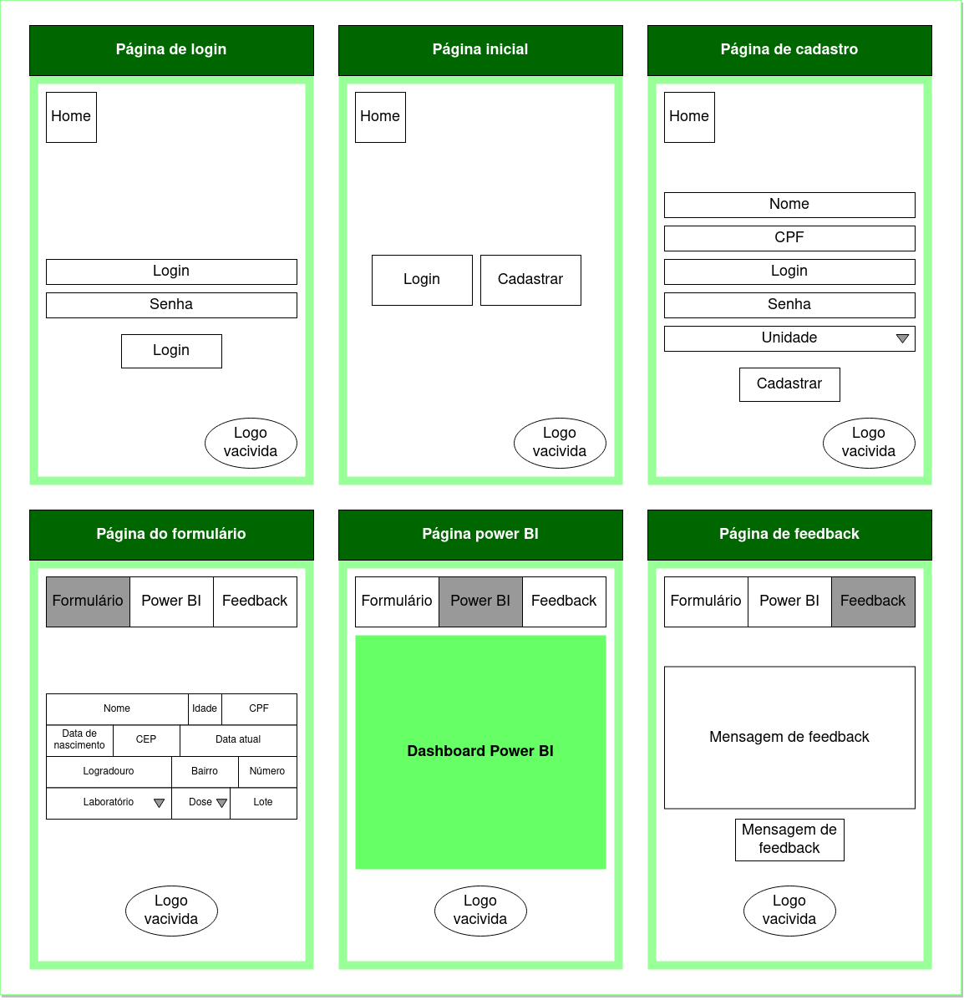

# Proejto EPUSP + Vacivida

<h2 align="center">
	Telas da aplicação:
</h2>
<p align="center">
  
  
</p>

<p> #2CAB7C #A9DECA #2B7930 #85517F #902CAB </p>


## Desenvolvimento

### Subir dados para banco pelo csv

```bash
curl -X POST https://engsoft-production-nmcardoso.cloud.okteto.net/import/csv/unidade_saude -F file=@data/datasus_unidades.csv -H "Content-Type: multipart/form-data"
```
<h2>O que fazer pra apresentação</h2>
- DER: olhar postgres: Engov faz
- Diagrama de classes: descobrir como fazer
- Diagrama de implantação: editar do drive: Natam completa o do drive
- Caso de uso genérico (aplicação de uma vacina e observar o funcionamento do PB): Chen descrevo o CU direitinho
- Vídeos: 
-   1min: sobre a inovação (PB), exaltar MUITO a importância de análise de dados, *(comenta sobre feedback)
-   2min: tentar logar sem conta -> cria uma conta -> loga com a conta -> olha as páginas -> preenche um formulário -> mostra o powerbi -> sincroniza -> mostra powerbi
-   2min: mostrar as interações entre os componentes no diagrama de implantação (ghpages, okteto, bd, tablet, pb) ao longo de algum caso de uso; expliar um pouco da API (atualização frequente dos dados no dash só foi possível pois fizemos uma API que puxa dados do banco por HTTP em um formato reconhecível pelo PB. Além disso, podemos definir como queremos puxar os dados do banco a partir de views. Isso é muito valioso pois podemos escolher os dados mais relevantes para a análise e conseguimos colocar uma inteligência de dados utilizando a view). Entra em coisas técnicas.
- PPT:
-   5min engsoft:
-     2min: DER [fabio], Diagrama de classes [marcus]
-     1min: Simulação da comunicação com vacivida (mostrar JSON, etc) [natan]
-     2min: processo de desenvolvimento, papéis na equipe e aprendizado [geral]
-   5min redes: 
-     1min: camadas utilizadas no projeto [chen]
-     2min: motivação da criação da parte da API que alimenta o banco e outra API pra alimenta PB: API restfull [fabio]:  Só podemos nos conectar externamente no oketeto por https. Como o postgres não utiliza https (utiliza um protocolo próprio), tinhamos 2 opções: ou criamos um túnel pra permitir conexão externa direta ou uma API http que faria a interface entre o BD com a rede externa.;|||| Front é completamente desacoplado do back. Sendo assim, é necessário ter uma API pra fazer os dois interagirem. [chen]
-     2min: funcionamento kubernet e okteto. [chen]
